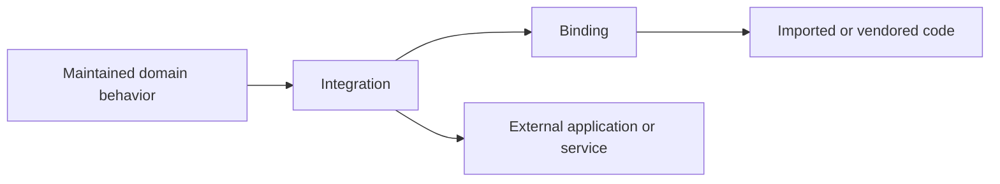

# Adapter architecture

An adapter is a nominal boundary role. `Binding` and `Integration` are distinct
subsets because they carry different authority and lifecycle constraints.
Neither role defines a generic `adapt()` operation.

This adapter meaning of binding does not replace the formal colored-Petri-net
term for a transition-variable binding or a contract field that binds an
implementation identity. Those bounded contexts retain their established
meaning and do not inherit from `Adapter`; use "dependency binding" when prose
would otherwise be ambiguous.

## Binding boundary

A binding adapts code that Project Koios imports as a declared dependency or
selectively vendors under recorded provenance. It owns dependency API
translation, exact component identity, selected-source identity, and documented
local compatibility behavior. A binding does not authorize an external
application invocation.

## Integration boundary

An integration adapts an external application or service. It owns application
requests and results, authentication or executable selection, workspace and
artifact boundaries, remote or process effects, bounded failure behavior, and
external-version evidence. An integration does not absorb dependency-specific
API adaptation when that concern can remain in a binding.

## Composition

An integration may have a binding. For example, a GitHub integration may use a
PyGithub binding, and a scientific integration may use an imported client
library binding. The integration remains responsible for the external effect;
the binding remains responsible for the code dependency.

## Ownership and migration

Repositories are named for capabilities, such as `projectkoios-github` or
`projectkoios-lammps`, rather than for the adapter kind. One capability
repository may own both binding and integration modules.

The Frankenstein package is an incubation overlay. A module below
`projectkoios.frankensteins.adapters` is designed to move to the corresponding
path below `projectkoios.adapters` by removing only the incubation namespace
segment. Shared namespace levels remain free of broad re-export behavior; leaf
facades may expose deliberate compositions.

"External" describes contribution or governance ownership when used in
repository classification. It is not a synonym for integration.
