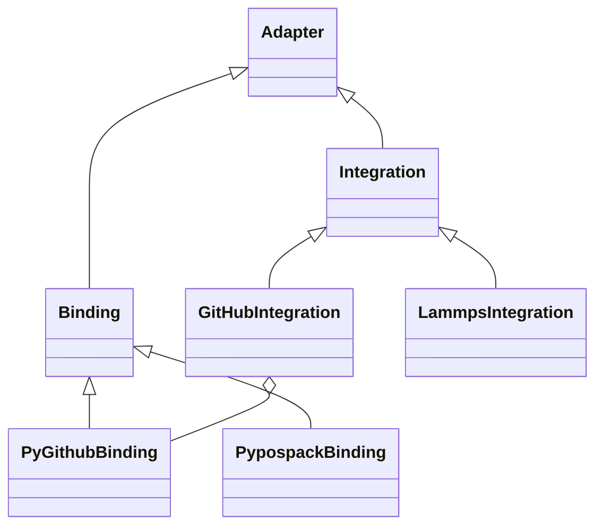
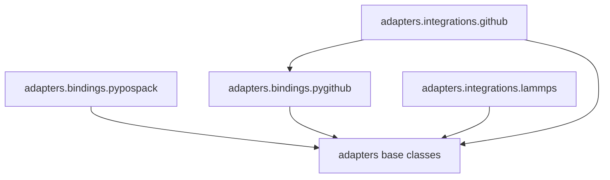

# Adapter implementation

**Incubation namespace:** `projectkoios.frankensteins.adapters`

**Migration namespace:** `projectkoios.adapters`

The proposed base-class and provider layout is:

The corresponding package dependencies are:

A capability repository may contribute more than one leaf namespace. For
example, `projectkoios-github` may publish both
`projectkoios.adapters.bindings.pygithub` and
`projectkoios.adapters.integrations.github`. Shared namespace directories must
remain compatible with Project Koios implicit namespace packaging. A provider
leaf `__init__.py` may act as an intentional facade or composition root; shared
parents do not aggregate every implementation class.

The historical PyFlamestk and PyPosPack reconstruction work moves toward
binding packages because it adapts pinned or vendored code. LAMMPS and VASP
remain integration packages because they represent external scientific
applications. A binding may produce a typed request consumed by an integration,
but it does not execute that application.
