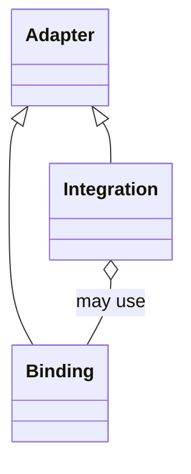

# Adapters

Adapters are the common architectural set for boundaries between maintained
Project Koios behavior and another code or system surface. This module defines
two named adapter kinds:

- a **binding** adapts imported or deliberately vendored code dependencies;
- an **integration** adapts an external application or service.

A provider capability may require both. They remain distinct base-class roles
and are connected through composition rather than collapsed into one hybrid
object.

The `projectkoios.frankensteins` namespace mirrors the intended
`projectkoios` namespace as a pick-and-pull incubation overlay. Migration
removes the `frankensteins` path segment; it does not rename the transferred
classes or redesign their relationships.

- [Architecture](architecture/index.md)
- [Implementation](implementation/index.md)
- [Specifications](specifications/index.md)
- [Testing](testing/index.md)
