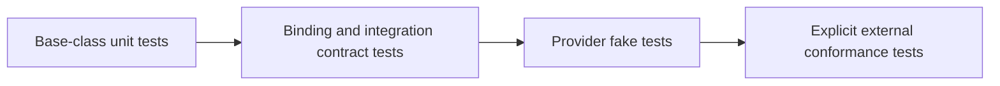

# Adapter testing

- Base-class tests verify nominal `Adapter`, `Binding`, and `Integration`
  membership without requiring a generic operation.
- Binding tests verify exact dependency identity, bounded API translation,
  selected-source provenance, and the absence of external execution authority.
- Integration tests use fakes first to verify typed requests, effect authority,
  bounded failures, artifact handling, and result attribution.
- Composition tests prove that integrations receive compatible bindings
  explicitly and do not hide them in global registries.
- Namespace tests verify that incubated module paths map to target paths by
  removing only `frankensteins`.
- Packaging tests verify implicit namespace compatibility when capability
  repositories contribute separate adapter leaves.
- Live application or service tests are opt-in conformance tests requiring
  operator-provided credentials, executables, workspaces, and version evidence.
- Binding conformance, integration execution, numerical verification, and
  scientific validation remain distinct test and evidence activities.
