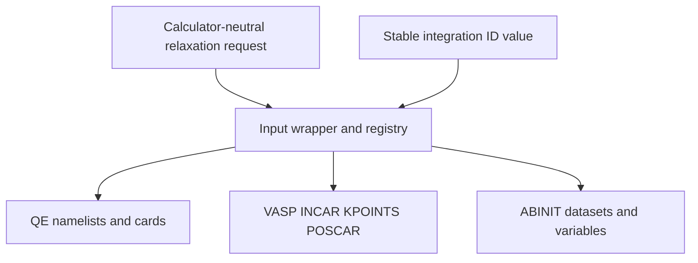

# Architecture

A generic workflow needs to select QE, VASP, or ABINIT without pretending that their optimizers, convergence criteria, or input syntaxes are equivalent.

The request owns shared scientific quantities: geometry scope, sampling, energy and force thresholds, pressure controls, and bounded ionic steps. Each integration owns its native optimizer and cell controls.

Descriptions record purpose, authority, support, companion fields, and qualifications. They support review and validation but never perform dynamic dispatch. Registry lookup uses structurally comparable `CalculatorIntegrationId` values.
