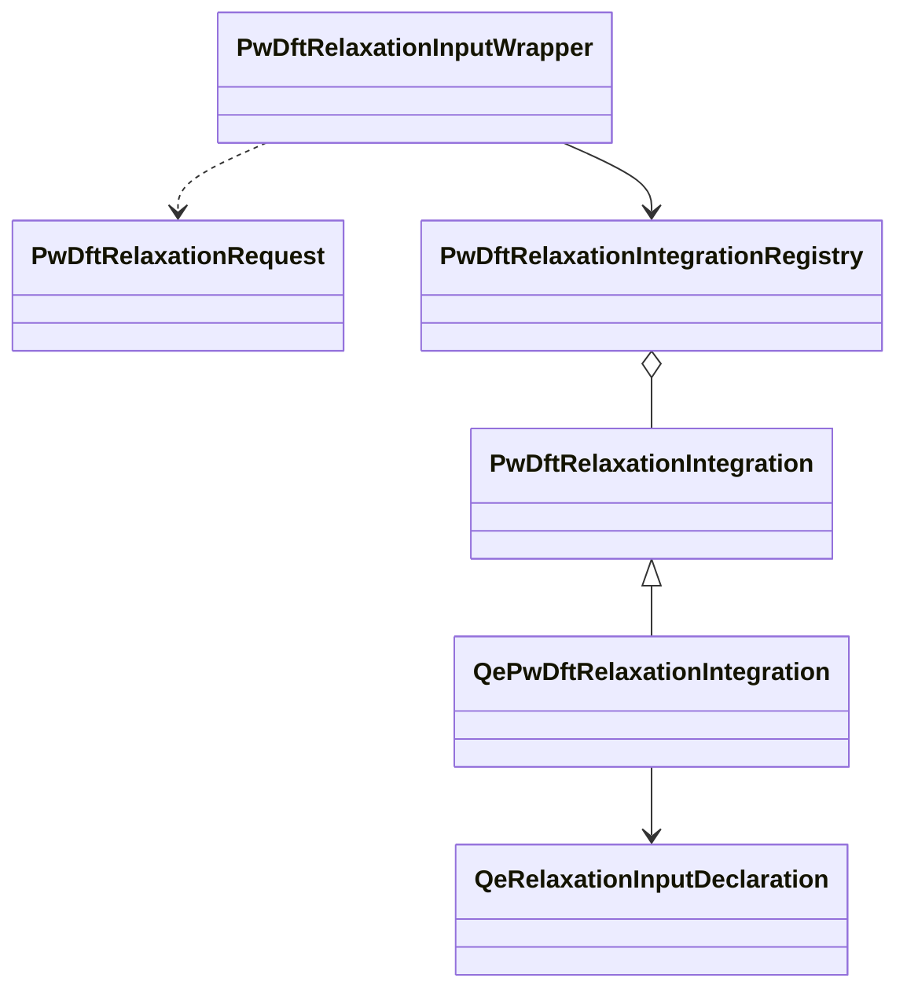

# Implementation

Calculator-neutral code lives under:

- `applications/calculator.py`
- `applications/pw_dft_relaxation/base.py`
- `applications/pw_dft_relaxation/capabilities.py`
- `applications/pw_dft_relaxation/integration.py`

The first native implementation lives under `integrations/quantumespresso/pw_dft_relaxation/`. It composes typed declarations for `&CONTROL`, `&SYSTEM`, `&ELECTRONS`, `&IONS`, optional `&CELL`, `ATOMIC_SPECIES`, `CELL_PARAMETERS`, `ATOMIC_POSITIONS`, and `K_POINTS` before rendering text.

VASP and ABINIT have reviewed input-family descriptions but no registered relaxation integration. Selection therefore fails closed for those values.

Integration IDs are immutable values. The generic layer does not create global QE, VASP, or ABINIT ID singleton constants; an integration declares its stable value and registry comparison is structural.
