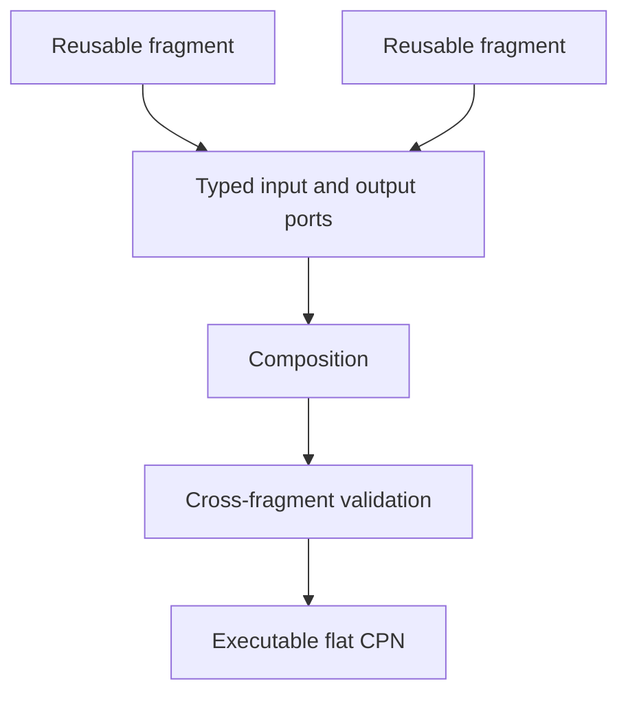

# Reusable CPN composition architecture

Potential-optimization workflows repeat control patterns: accept a candidate,
request an external simulation, correlate a result, calculate a property,
classify failure, and aggregate objectives. Copying those patterns into every
net makes semantics drift and review difficult.

A fragment template owns a bounded internal pattern of colors, places,
transitions, arcs, ports, and local priorities. Templates are inheritable so a
specialized scientific workflow can reuse and extend an established pattern
without copying it. A derived template declares its base-template identity and
an explicit semantic delta; it cannot mutate the base template.

Instantiation binds a template to a namespace and produces an immutable
fragment. Composition connects compatible ports, namespaces internal
identities, resolves priority policy explicitly, and produces one ordinary CPN
definition for the workflow kernel.

The initial design is template inheritance and composition-time reuse, not
hierarchical CPN execution.
The workflow kernel continues to validate, enable, select, and fire a
non-hierarchical net. Fragment boundaries remain as provenance and visualization
annotations after flattening.
