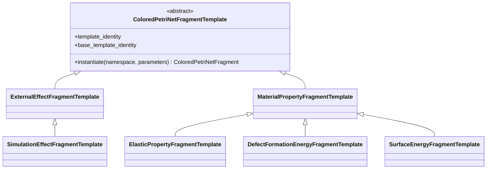
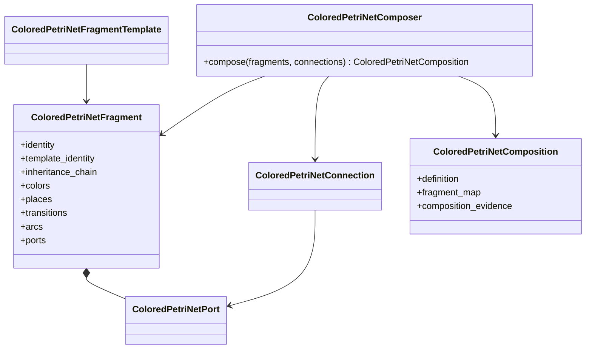
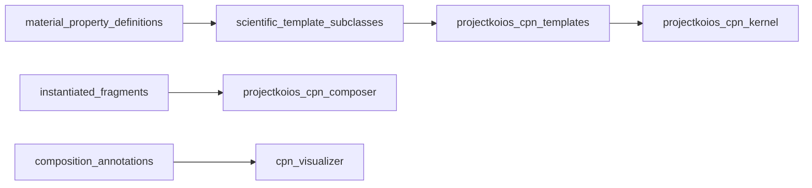

# Reusable CPN composition implementation

**Target generic owner:** `projectkoios-cpn`

**Proposed scientific fragment package:**
`projectkoios.frankensteins.workflows.fragments`

The current kernel is incubated under
`projectkoios.workflow.petrinet.colored`; it is transfer evidence rather than
the target import namespace. Template inheritance is separate from kernel
inheritance. The public
`ColoredPetriNetDefinition`, marking, validator, enabler, selector, and firer
objects remain exact immutable workflow-kernel types and are not subclassed.
Derived templates extend through validated declarations rather than arbitrary
mutation of inherited fragment internals.
