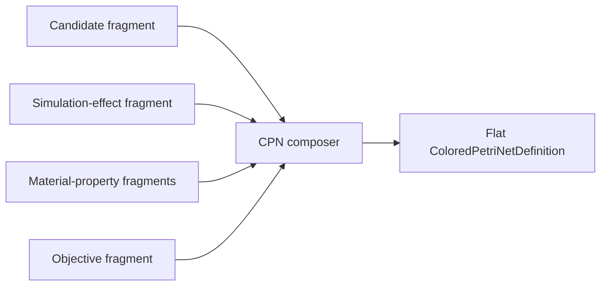

# Reusable CPN composition

**Status:** Target module; generic composition belongs to the future
`projectkoios-cpn` owner

Reusable workflow behavior is defined as inheritable typed CPN fragment
templates. Instantiated immutable fragments are composed into one validated
non-hierarchical net.

- [Architecture](architecture/index.md)
- [Implementation](implementation/index.md)
- [Specifications](specifications/index.md)
- [Testing](testing/index.md)
