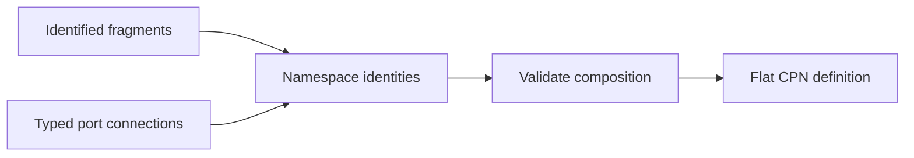

# Reusable CPN composition specifications

- Every fragment template **MUST** have an immutable identity covering its
  semantic content and template-contract version.
- A derived template **MUST** identify its direct base template and complete
  inheritance chain.
- Derived templates **MUST** preserve inherited public port contracts and
  **MUST NOT** weaken admitted colors, multiplicity, direction, or required
  behavior.
- Extension and override points **MUST** be explicitly declared by the base
  template; arbitrary mutation of inherited places, transitions, arcs, or guards
  **MUST** be rejected.
- Every instantiated fragment **MUST** bind template identity, inheritance chain,
  namespace, parameters, and resulting semantic content.
- Public ports **MUST** declare direction, admitted colors, token contract, and
  multiplicity expectations.
- Internal place, transition, arc, and variable identities **MUST** be namespaced
  deterministically during composition.
- Connections **MUST** reject incompatible colors, directions, or multiplicity
  contracts.
- Composition **MUST** reject undeclared identity collisions and unresolved
  ports.
- Global transition priority and selection policy **MUST** be resolved
  explicitly; tuple order or import order **MUST NOT** decide them implicitly.
- The composed result **MUST** be an ordinary validated
  `ColoredPetriNetDefinition` accepted by the target `projectkoios-cpn`
  contract.
- Fragment and connection identities **MUST** remain available as composition
  evidence and visualization grouping metadata.
- Flattening **MUST NOT** be described as hierarchical CPN support.
