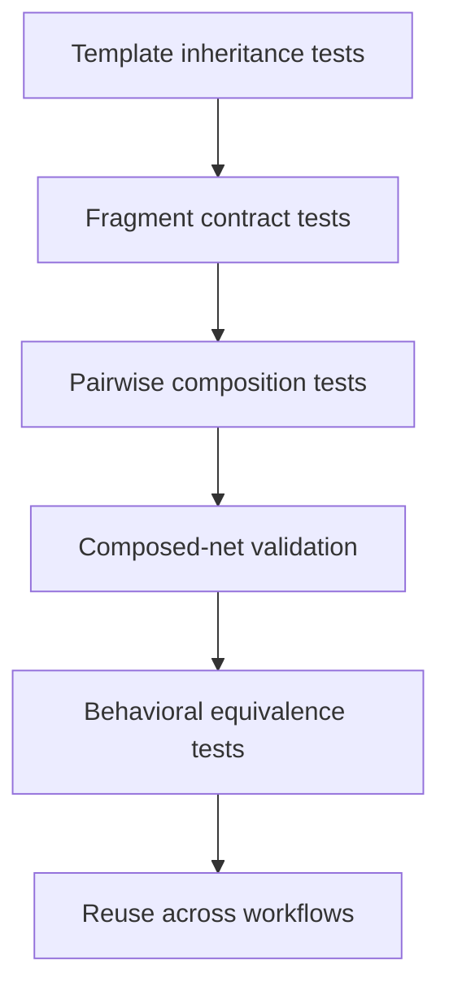

# Reusable CPN composition testing

- Template inheritance tests verify inherited behavior, declared extension
  points, port substitutability, inheritance identity, and rejection of base
  mutation or contract weakening.
- Fragment tests validate closed internal references, declared ports, template
  provenance, and local identity uniqueness.
- Adversarial composition tests cover color mismatch, direction mismatch,
  unresolved ports, collisions, priority ambiguity, and cyclic control patterns.
- Determinism tests compose the same fragments in different caller orders and
  require the same definition and composition identities.
- Behavioral tests compare enablement and firing of a composed net with an
  independently stated flat reference net.
- Reuse tests instantiate one simulation-effect template in multiple material
  properties, derive specialized property templates without copying base
  declarations, and use one property fragment in multiple workflows.
- Visualization tests preserve fragment grouping without changing the flattened
  CPN definition or marking.
