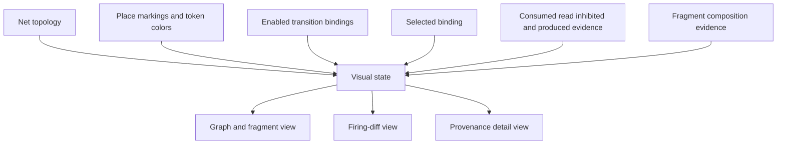

# Colored-Petri-net visualization architecture

A CPN is difficult to review from identities and nested records alone. Reviewers
need to see topology, token state, enabled behavior, selected behavior, and the
change caused by a firing without granting the viewer control over execution.

The visualizer is a projection over immutable CPN evidence. It never computes
enabledness independently, selects a binding, fires a transition, dispatches an
effect, or edits a marking.

Generic topology and marking presentation are workflow concerns. Scientific
annotations explain that a token represents a candidate, structure, simulation
request, result, material-property observation, objective, or failure. Those
annotations do not redefine token or firing semantics. Composition evidence may
group the flattened graph by reusable fragment while preserving the exact node
and arc identities of the executable definition.
