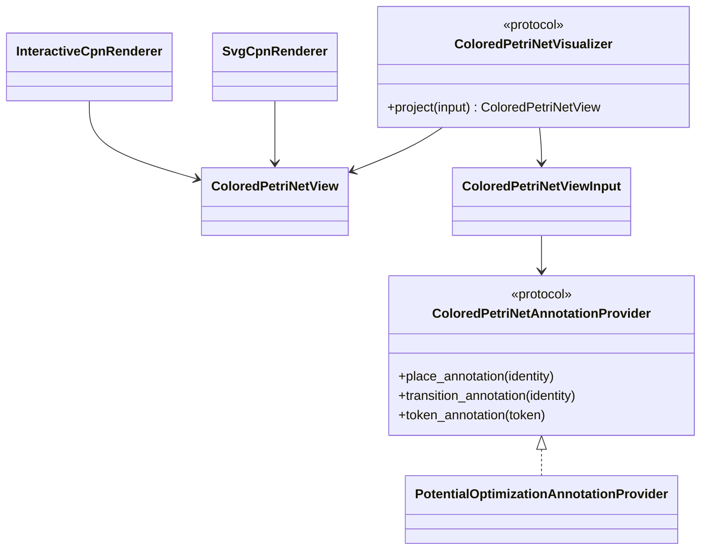
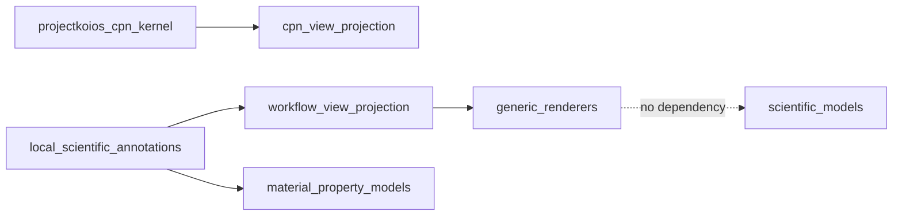

# Colored-Petri-net visualization implementation

**Target generic owner:** `projectkoios-cpn`

**Proposed local adapter:**
`projectkoios.frankensteins.workflows.potential_optimization_cpn.annotations`

Until `projectkoios-cpn` accepts a view contract or wire format, the local
architecture should not invent a competing serialized CPN representation. The
current `projectkoios-workflow` shadow may provide transfer fixtures but is not
the permanent visualizer namespace. An
exploratory renderer may consume exact in-memory public records only and must be
labeled experimental.
