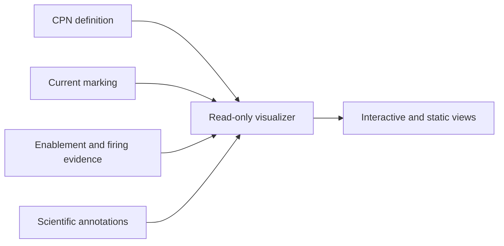

# Colored-Petri-net visualization

**Status:** Target module; generic renderer ownership belongs to the future
`projectkoios-cpn` owner

The visualizer makes a CPN definition and its current execution evidence
inspectable without changing workflow state.

- [Architecture](architecture/index.md)
- [Implementation](implementation/index.md)
- [Specifications](specifications/index.md)
- [Testing](testing/index.md)
