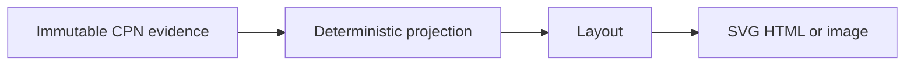

# Colored-Petri-net visualization specifications

- The visualizer **MUST** be read-only and **MUST NOT** expose transition firing,
  effect dispatch, marking mutation, or authority controls.
- The view **MUST** identify the exact CPN definition and marking.
- Places, transitions, directed arcs, arc modes, token colors, and token
  multiplicities **MUST** be visible or inspectable.
- Enabled bindings, the selected binding, guards, inhibitors, and transition
  priority **MUST** be distinguishable.
- A firing view **MUST** distinguish consumed, read, inhibited, retained, and
  produced token evidence.
- Scientific annotations **MUST** remain separate from generic CPN semantics.
- Fragment boundaries and typed port connections **SHOULD** be visible when
  composition evidence is available, without implying hierarchical execution.
- Layout **SHOULD** be deterministic for identical view input.
- Static export **SHOULD** support SVG; interactive presentation **MAY** add HTML
  inspection without becoming a workflow control surface.
- No public JSON format **MUST** be claimed before `projectkoios-cpn` accepts a
  wire contract.
