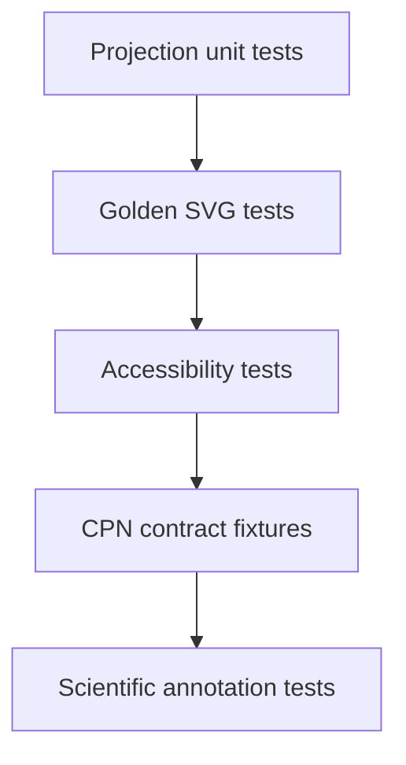

# Colored-Petri-net visualization testing

- Projection tests verify every place, transition, arc, token, binding, and audit
  item appears exactly once with the correct identity.
- Golden tests use small canonical nets covering concurrency, conflict, read
  arcs, inhibitors, repeated anonymous tokens, and identified tokens.
- Firing-diff tests distinguish consumed, read, retained, and produced tokens.
- Determinism tests compare byte-stable view models and, where practical, static
  SVG output.
- Accessibility tests require non-color labels, keyboard-inspectable interactive
  content, and textual alternatives.
- Security tests escape all token values and annotations before HTML or SVG
  rendering.
- Scientific annotation tests prove labels do not alter CPN identities,
  enabledness, selection, or firing results.
