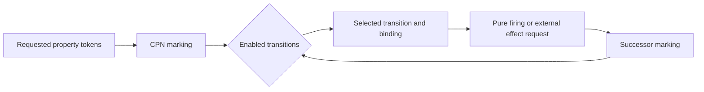

# Colored-Petri-net workflow architecture

Material-property evaluation is concurrent, conditional, and stateful. Several
properties can share simulations; some calculations become possible only after
particular results exist; failures can block or redirect later work. A colored
Petri net represents these semantics directly rather than reducing them to a
linear task list.

Reusable typed fragments are composed and flattened into a net definition that
specifies places, token colors, transitions, guards, inscriptions, and
transition priority. The marking is authoritative workflow state. Enabledness defines what may proceed; deterministic selection chooses
among enabled bindings without changing enabledness.

Scientific code defines how potential candidates, structures, simulation
requests, simulation results, material-property observations, and failures map
to token colors. `projectkoios-cpn` retains authority over validation,
enablement, selection, and pure firing semantics. `projectkoios-workflow` owns
run orchestration, effect coordination, and replay around those pure semantics.

External calculator execution occurs outside the CPN kernel. Its identified
result is supplied back through an explicit external-output binding before the
successor marking is produced.
