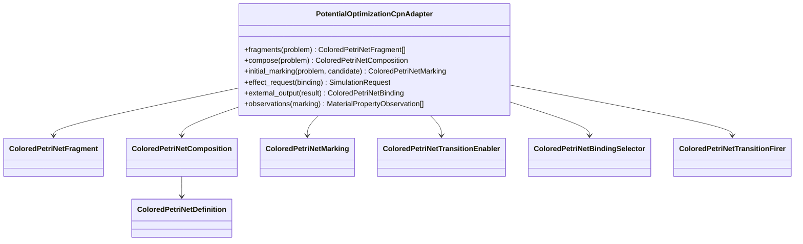
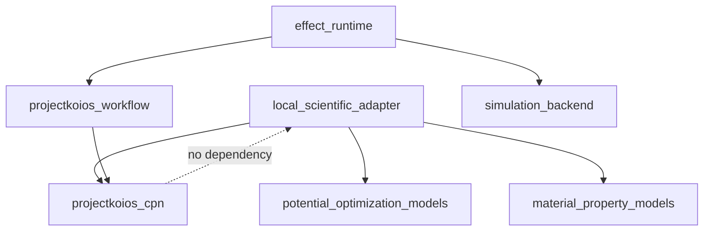

# Colored-Petri-net workflow implementation

**Target dependencies:** `projectkoios-cpn` for CPN semantics and
`projectkoios-workflow` for workflow runtime contracts

**Proposed local adapter package:**
`projectkoios.frankensteins.workflows.potential_optimization_cpn`

The current CPN kernel is incubated under
`projectkoios.workflow.petrinet.colored`. That import surface is
non-authoritative shadow evidence and must not become the permanent dependency
of this adapter. Migration targets the accepted `projectkoios-cpn` namespace,
with any temporary compatibility bridge owned and versioned explicitly.
