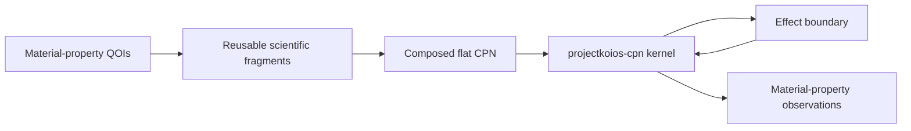

# Colored-Petri-net workflow

**Status:** Target module; implementation is blocked on accepted
`projectkoios-cpn` kernel contracts and a released `projectkoios-workflow`
adapter/runtime contract

This module maps potential optimization and material-property evaluation onto
colored-Petri-net semantics ultimately owned by `projectkoios-cpn` and run-state
orchestration owned by `projectkoios-workflow`. It does not
implement another task graph or workflow kernel.

- [Architecture](architecture/index.md)
- [Implementation](implementation/index.md)
- [Specifications](specifications/index.md)
- [Testing](testing/index.md)
