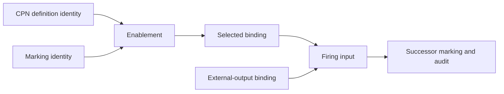

# Colored-Petri-net workflow specifications

- Workflow control **MUST** use accepted public CPN contracts from
  `projectkoios-cpn`; this repository **MUST NOT** implement a competing graph
  scheduler or CPN kernel.
- Run orchestration, effect coordination, and replay **MUST** use accepted
  `projectkoios-workflow` contracts.
- The local adapter **MUST** define reusable scientific fragments with a stable
  mapping from domain concepts to colors, places, transitions, guards,
  inscriptions, and typed ports.
- Fragments **MUST** be composed into one validated non-hierarchical definition
  before enablement.
- The CPN definition and every marking **MUST** have exact identities.
- Enabledness **MUST** remain separate from deterministic binding selection.
- External effects **MUST NOT** occur inside validation, enablement, selection,
  or pure firing.
- A calculator result **MUST** enter through an explicit identified
  external-output binding.
- Shared simulations **MUST** be represented so one result token can enable all
  dependent property calculations without duplicate execution.
- Failure and retry policy **MUST** be explicit net or runtime policy, never
  inferred from missing files.
- Integration **MUST** remain blocked while the dependency is documented as a
  non-authoritative shadow without a compatibility promise.
