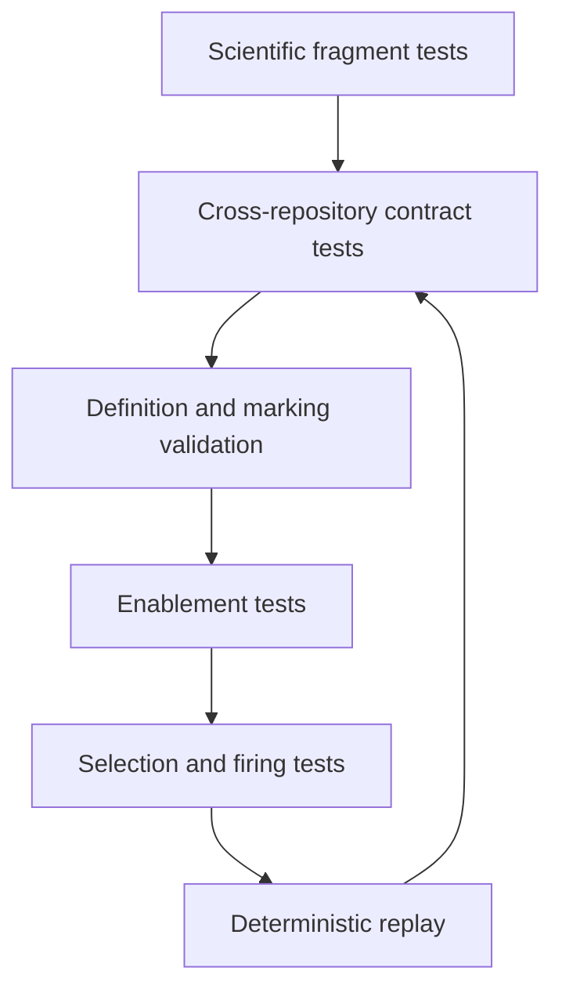

# Colored-Petri-net workflow testing

- Fragment tests verify every QOI requirement becomes the expected places,
  colors, transitions, guards, inscriptions, and typed ports.
- Composition tests verify deterministic namespacing, connections, global
  priority, and equivalence with the expected flat net.
- Structural tests use the dependency's definition and marking validators.
- Enablement tests cover independent, shared, blocked, failed, and concurrently
  enabled material-property calculations.
- Selection tests prove deterministic policy does not redefine enabledness.
- Firing tests verify consumed, read, inhibited, and produced tokens plus audit
  evidence and external-output bindings.
- Replay tests require identical definition, marking, binding, output evidence,
  successor marking, and identities.
- Contract tests bind exact accepted `projectkoios-cpn` and
  `projectkoios-workflow` versions and their compatibility statements.
- The current CPN shadow in `projectkoios-workflow` may support transfer and
  exploratory conformance tests but cannot satisfy the production dependency
  gate.
