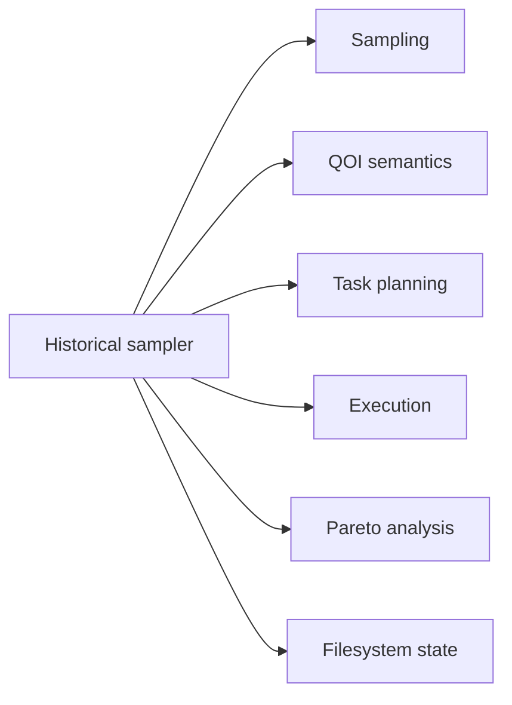
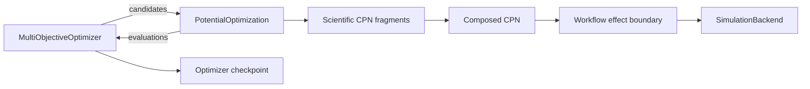

# Decision 0001: Separate optimizer policy from potential problems

**Status:** Accepted target decision

**Scope:** Maintained potential-optimization workflows

## Context

The historical PyPosPack iterative sampler combines sampling, QOI evaluation,
task execution, Pareto analysis, filesystem state, and restart behavior. That
coupling makes it difficult to determine whether a change affects optimization
policy, scientific meaning, calculator integration, or only operations.

## Decision

The maintained architecture models potential fitting as a
`MultiObjectiveOptimizer` operating on a `PotentialOptimization` problem.

`PotentialOptimization` owns scientific inputs, parameter resolution,
constraints, structures, material-property QOIs, observations, and objective
transforms.
`MultiObjectiveOptimizer` owns candidate proposal, iterative sampling, selection,
random state, and optimizer checkpoints. `projectkoios-cpn` owns CPN semantics,
`projectkoios-workflow` owns effect coordination, and a simulation backend owns
calculator interaction.

## Consequences

### Positive

- Alternative optimizers can evaluate the same problem.
- The historical optimizer can be tested without invoking LAMMPS.
- QOI calculations can be compared independently of Pareto or KDE behavior.
- Raw scientific observations remain distinct from optimization losses.
- Restarts use explicit state instead of incidental directory contents.
- Provenance can identify problem, optimizer, and execution components
  independently.

### Costs

- Historical dictionary-based APIs require adapters.
- Candidate, observation, objective, task, and checkpoint models must be made
  explicit.
- The original workflow cannot be wrapped faithfully by a single shallow class.
- Conformance tests are required at every adapter boundary.

## Rejected alternatives

### Treat the historical sampler as the domain model

Rejected because it makes optimizer mechanics authoritative for scientific
semantics and preserves filesystem and MPI coupling.

### Put target comparison inside each QOI evaluator

Rejected because physical observations would be lost or conflated with a
particular loss definition.

### Put LAMMPS execution inside `PotentialOptimization`

Rejected because the problem should contribute reusable CPN fragments that
define required scientific behavior without owning process authority, workspace
allocation, or concurrency.

### Rewrite the historical input into a new format

Rejected because the source input is immutable provenance. A maintained adapter
produces typed configurations without changing the original bytes.

## Verification obligations

These are separate obligations, not automatic maturity levels. In particular,
matching historical task planning does not prove numerical equivalence, and
numerical equivalence does not establish scientific validity.
