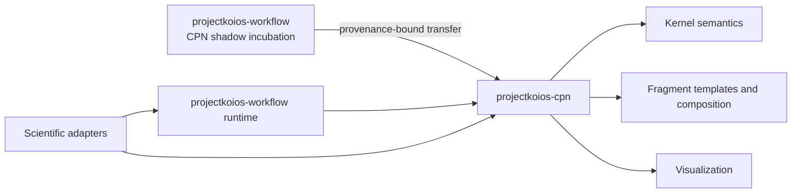

# Decision 0002: Target generic CPN ownership in projectkoios-cpn

**Status:** Accepted target direction; implementation blocked on contract and
release acceptance

**Scope:** CPN kernel, reusable fragment templates, composition, and
visualization

## Context

A generic colored-Petri-net kernel currently exists as a non-authoritative
shadow under `projectkoios.workflow.petrinet.colored`. Its own documentation
states that it provides pure definition, marking, validation, enablement,
selection, and firing but no production authority, compatibility promise,
dispatch, persistence, or public wire format.

Potential optimization needs those semantics, reusable inheritable fragments,
composition, and visualization. Treating the incubation namespace as permanent
would couple scientific adapters to a known transitional owner.

## Decision

Generic CPN capabilities will eventually be imported into
`projectkoios-cpn`.

`projectkoios-workflow` remains responsible for engine-neutral workflow runs,
effect coordination, state snapshots, audit, persistence boundaries, and replay.
This repository owns scientific fragment subclasses, material-property mappings,
and visual annotations.

## Transfer constraints

- The current shadow remains source and behavioral evidence until transfer is
  accepted.
- The destination requires an accepted contract, versioned import surface,
  identity policy, release, rollback plan, and compatibility statement.
- Byte identity alone does not accept the destination architecture.
- Temporary compatibility imports must be isolated behind an explicit adapter.
- Scientific modules must not encode the temporary
  `projectkoios.workflow.petrinet.colored` namespace as a durable wire identity.
- No repository may claim CPN Tools or ISO/IEC 15909-1 compatibility without the
  separately required mapping and evidence.

## Consequences

The production dependency is intentionally blocked today. Architecture and test
fixtures may use the current shadow to develop transfer evidence, but maintained
runtime integration waits for the target owner to publish accepted contracts.
