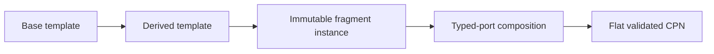

# Decision 0003: Inherit templates and compose immutable CPN fragments

**Status:** Accepted target decision

**Scope:** Reusable CPN subgraphs

## Context

Scientific workflows repeatedly need the same CPN patterns. Pure copy-and-edit
reuse causes drift, while subclassing kernel definitions or mutable graph objects
would weaken exact identity and validation.

## Decision

Reusable behavior is expressed through inheritable fragment templates.
Instantiation binds a template to explicit parameters and a namespace, producing
an immutable fragment. The composer connects typed fragment ports and flattens
the result into one ordinary non-hierarchical CPN definition.

Kernel definitions, markings, validators, enablers, selectors, and firers are not
subclass extension points.

## Inheritance constraints

A derived template:

- identifies its base and complete inheritance chain;
- preserves inherited public port contracts;
- extends only declared extension points;
- expresses overrides as explicit validated semantic deltas;
- cannot mutate the base template or an existing fragment instance; and
- receives a distinct identity covering base identity and local delta.

## Consequences

Common effect, failure, retry, property-calculation, and objective patterns can
be reused without copying. The composed net remains compatible with the generic
non-hierarchical kernel. The visualizer may show inherited template and fragment
boundaries, but those boundaries do not introduce hierarchical firing semantics.
