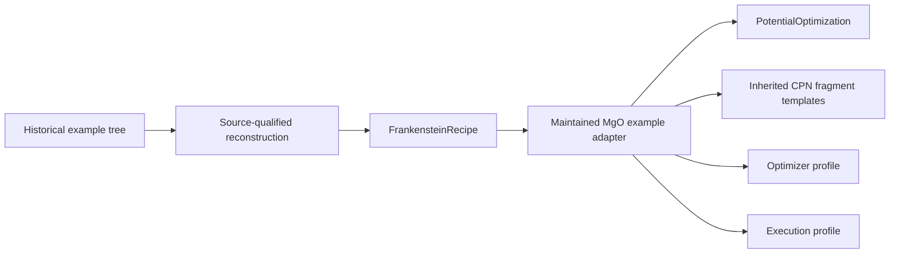

# Decision 0004: Use Frankenstein recipes for PyFlamestk examples

**Status:** Accepted target decision

**Scope:** PyFlamestk `lmps_MgO_*` worked examples

## Context

The pinned PyFlamestk source contains related MgO examples for uniform, KDE,
from-file, single-candidate, iterative Pareto, MPI, postprocessing, regression,
and surface workflows. Their scripts combine scientific declarations,
optimization policy, execution details, and machine-specific shell behavior.

The repository already records exact example-tree identities and defines a
narrow `FrankensteinRecipe` reconstruction boundary for the serial-uniform
workflow.

## Decision

Every maintained worked example starts from an exact source-qualified binding
and its reconstructed `FrankensteinRecipe`. Engine-shaped examples will use the
planned engine catalog; analysis and postprocessing examples require dedicated
non-engine binding kinds.

Historical scripts are not imported, patched into maintained launchers, or used
as execution entrypoints. The adapter consumes maintained observations,
mathematical models, warnings, structures, and integration intents from the
recipe.

## Scenario normalization

- Scientifically identical trees share problem and fragment templates.
- Uniform, KDE, from-file, and iterative variants specialize optimizer policy.
- Serial and MPI variants specialize execution policy.
- Postprocessing variants consume recorded observations and objectives.
- Regression variants provide replay and conformance fixtures.
- Unsupported historical QOI vocabulary remains blocked.
- Path-qualified provenance remains distinct even when source tree identities
  are equal.

## Consequences

The examples exercise the current Frankenstein rather than creating another
legacy compatibility runtime. Improvements to the maintained problem, CPN,
visualization, and workflow boundaries can be demonstrated across several
historical scenarios without duplicating their scientific model.
