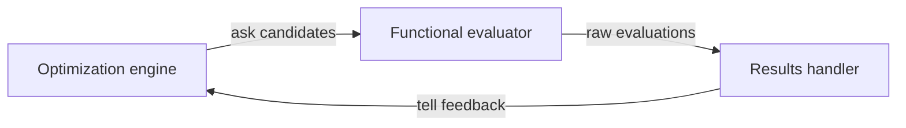

# Decision 0006: Solve potential fitting as a forward-evaluated inverse problem

**Status:** Accepted target decision

**Scope:** Maintained interatomic-potential fitting workflows

## Context

The historical engine reads several configuration files and then constructs
samplers, potentials, QOI managers, simulation managers, and execution state in
one object. Its sampling loop proposes parameters, executes simulations,
calculates observations, writes results, and updates later optimization work.
That arrangement demonstrates the required feedback cycle but does not preserve
clear maintained boundaries.

Interatomic-potential fitting is an inverse problem: candidate potential
parameters are inputs to a forward evaluator, and calculated material
properties are compared with independently generated high-fidelity reference
QOIs to guide later candidates.

## Decision

Use a three-role feedback architecture:

- `OptimizationEngine` owns proposal and update policy.
- `FunctionalEvaluator` owns forward evaluation and returns raw observations.
- `ForwardFunctionExecutionEngine` is the interatomic-potential specialization
  of that evaluator. It combines one resolved potential, structures, and QOI
  definitions; deduplicates and executes required simulations; and calculates
  raw material-property observations.
- `ResultsHandler` preserves observations, derives declared optimizer feedback,
  and sends it to the exact optimization-engine instance that proposed the
  candidates.

The same QOI architecture is used in two paths. Before optimization, a DFT model
is evaluated through VASP to produce a qualified immutable reference QOI set.
Inside the loop, candidate interatomic potentials are evaluated through LAMMPS
to produce predicted QOIs. The paths share QOI definitions and normalized
observation contracts but retain backend-specific plans and provenance.

Reference QOIs and objective losses do not belong to the candidate
forward-function execution engine. Simulation identities, artifacts, failures,
and raw predicted QOI observations do.

A `ParameterSampler` is a candidate-proposal component contained by the
optimization engine. It accepts probability-distribution definitions only. For
an independent multidimensional uniform distribution, every dimension has its
own `UniformProbabilityDistributionParameters`.

The interatomic potential and every candidate `parameters` value are immutable.
Fixed and dependent parameters are resolved into a complete candidate before
forward evaluation. LAMMPS evaluates the parameterized interatomic potential;
LAMMPS itself is not the parameterized scientific model. VASP supplies the
initial high-fidelity DFT
reference integration. Neither calculator is part of the optimizer or parameter
sampler.

## Consequences

### Positive

- The same optimizer can drive an in-process function, fake backend, captured
  calculator evidence, or LAMMPS integration.
- Predicted and reference observations remain durable and separate from
  objective losses.
- Reference QOIs are reusable across optimization runs.
- Shared simulation requirements can be planned once for several QOIs.
- Candidate proposal can be tested without materials or calculators.
- Scientific models can be tested without optimizer update policy.
- Feedback delivery and optimizer state changes become directly observable.
- Configuration can instantiate and identify each role independently.

### Costs

- Candidate, forward evaluation, raw observation, objective feedback, and
  optimizer state require explicit immutable models.
- Results-handler behavior requires tests proving that it feeds the proposing
  optimizer instance.
- Historical monolithic state needs bounded adapters rather than a shallow
  wrapper.
- Full execution still requires workflow and external-effect boundaries.

## Rejected alternatives

### Put material structures and constraints in the parameter sampler

Rejected because parameter sampling is optimizer proposal policy. Materials,
scientific constraints, and calculators belong downstream.

### Let the functional evaluator update the optimizer

Rejected because it couples forward-model semantics to one optimization policy
and obscures raw observations.

### Replace raw observations with objective values

Rejected because objective transforms are derived views and may change without
changing the forward calculation.

### Mutate one shared interatomic potential

Rejected because mutation obscures candidate identity, replay, concurrency, and
provenance. Each evaluated candidate receives an immutable resolved parameter
value.

## Verification obligations

Fast tests must demonstrate deterministic independent sampling, immutable
candidate construction, QOI-to-simulation planning and deduplication, forward
evaluation, predicted/reference result preservation, feedback handling, and
`tell` delivery. Historical reconstruction conformance, LAMMPS numerical
verification, VASP convergence and reference qualification, and scientific
validation remain separate claims.
