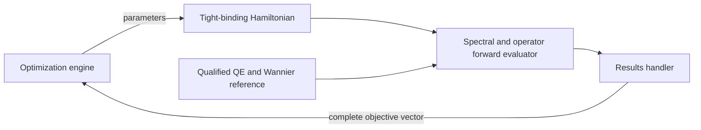

# Decision 0007: Adapt the feedback loop to reduced Hamiltonians

**Status:** Accepted target decision

**Scope:** Reconstruction intended for the `ksdft2effmass` bulk-silicon
spectral/operator compatibility problem

## Context

The MgO PyPosPack/PyFlamestk workflow demonstrates a reusable inverse-problem
shape: propose parameters, execute a forward model, compare several predicted
QOIs with a separately established reference, preserve the full error vector,
retain Pareto-efficient candidates, and refine later proposals.

The target application is not a new MgO fitting implementation. The first
`ksdft2effmass` problem is to determine whether one parameterized tight-binding
Hamiltonian can satisfy both spectral and aligned-operator requirements relative
to the same accepted bulk-silicon Kohn--Sham/Wannier parent.

## Decision

Adapt the reconstructed loop by replacing its scientific specialization while
retaining the role separation:

The Quantum ESPRESSO and Wannier90 reference path runs outside candidate
optimization. Candidate evaluation constructs and evaluates tight-binding
Hamiltonians in process. It does not rerun DFT for each parameter vector.

The model-class hierarchy is an outer frozen scientific choice. Within each
class, the optimizer explores immutable tight-binding parameter candidates. The
results handler retains raw spectral and operator observations and returns the
complete ordered objective vector. The optimizer owns Pareto selection,
proposal refinement, random state, and checkpoints.

One exact candidate must satisfy both the spectral and operator criteria.
Independent best fits do not establish compatibility. Withheld data remain
outside optimizer feedback. Failure to find an intersection through finite
sampling is not proof that the admissible sets are disjoint.

## Consequences

### Positive

- Historical sampling and Pareto behavior can be reconstructed independently of
  MgO-specific physics.
- Expensive DFT and Wannier reference generation is separated from repeated
  inexpensive candidate evaluation.
- Spectral and operator fidelity remain distinct objectives.
- The same feedback architecture can later support impurity and continuum model
  classes without redefining the optimization loop.
- Existing `ksdft2effmass` operator, QOI, parameter-study, workflow, and
  provenance contracts remain the target ownership boundary.

### Costs

- Tight-binding model classes, parameter domains, alignments, objective
  normalizations, tolerances, and training/withheld partitions must be frozen
  explicitly.
- Alignment introduces a bounded nuisance-variable problem whose identity and
  behavior require separate tests.
- Pareto search can locate candidate tradeoffs but cannot by itself certify
  positive separation or global incompatibility.
- Transfer requires adapters to existing `ksdft2effmass` contracts rather than
  direct reuse of MgO domain objects.

## Rejected alternatives

### Rebuild the MgO workflow as the product target

Rejected because MgO is historical methodological evidence. The target
scientific question concerns bulk-silicon reduced Hamiltonians.

### Execute Quantum ESPRESSO for every candidate

Rejected because candidate parameters define a reduced tight-binding model. The
qualified Kohn--Sham/Wannier parent is immutable reference evidence produced
before fitting.

### Compare two independently selected best fits

Rejected because spectral and operator optima may be different Hamiltonians.
Compatibility requires one common candidate or a justified set-intersection
result.

### Feed withheld values back to the optimizer

Rejected because it destroys the declared separation between fitting and
validation evidence.

### Infer incompatibility from optimizer failure

Rejected because a finite or local search supplies no certified global lower
bound on admissible-set separation.

## Unresolved scientific inputs

Implementation can provide strict contracts before these values are selected,
but it must not invent:

- the exact ordered model-class hierarchy;
- parameter names, bounds, units, and symmetry relations for each class;
- spectral training points and weights;
- the admissible alignment group and alignment algorithm;
- retained real-space blocks and shell weights;
- objective normalization and operator tolerance;
- map metric and compatibility tolerance; or
- optimizer budget, initialization, continuation, and stopping policy.

Those are human-owned scientific decisions in `ksdft2effmass`.
