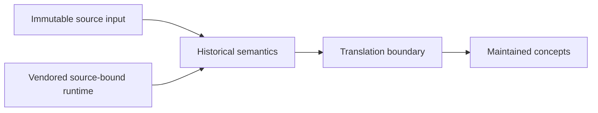

# Historical PyPosPack adapter architecture

Historical reconstruction must preserve source behavior closely enough for
conformance while preventing historical coupling from becoming the maintained
design. The adapter is an anti-corruption boundary.

The boundary owns safe interpretation, dictionary-to-model translation,
compatibility decisions, and source-qualified failures. It does not authorize
pin changes or silently repair source defects.

Every local deviation is explicit. Vendored files remain byte-identical unless
recorded as derived files. Reconstruction conformance remains separate from
numerical verification and scientific validation.
