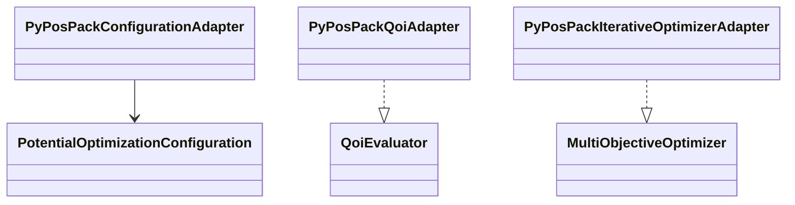
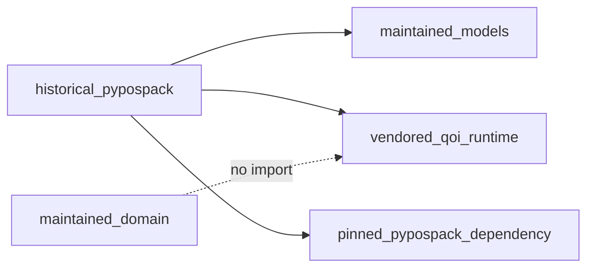

# Historical PyPosPack adapter implementation

**Proposed package:** `projectkoios.frankensteins.historical.pypospack`

The example launcher currently provides the configuration adapter and QOI package
overlay. These are transitional. The desired package adapter will make every
translation explicit and keep vendored modules outside the maintained domain
namespace.
