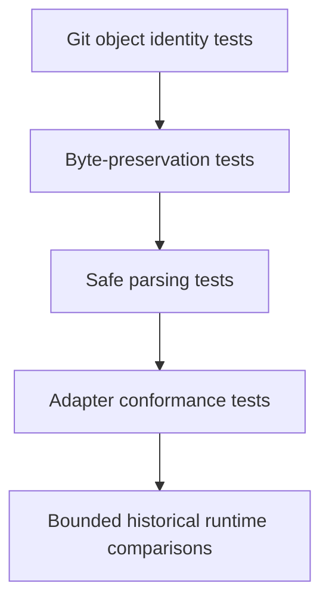

# Historical PyPosPack adapter testing

- Vendoring tests verify commit, tree, selected path, Git mode, blob, SHA-256,
  byte size, and license identities.
- `--check` mode proves the repository matches the manifest without modifying it.
- Parser tests reject arbitrary YAML object tags, unsafe expressions, unknown
  modes, path traversal, and incomplete potential parameters.
- Adapter tests compare maintained models with source dictionaries and task
  plans.
- Known defects receive explicit regression tests.
- Upstream code is executed only after vendoring and review, never from the
  operator checkout.
- Full LAMMPS execution remains a separate numerical-verification activity.
