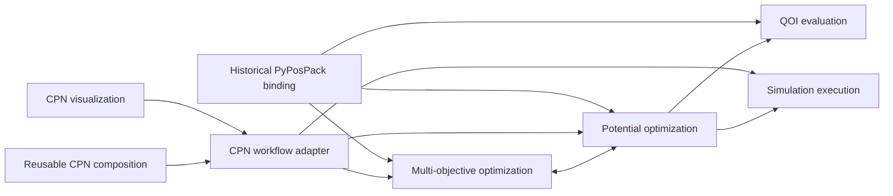
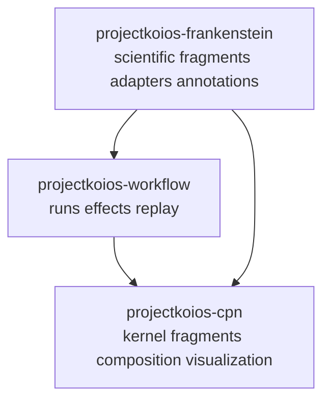

# Desired architecture

This section defines the target maintained architecture for executable,
provenance-bound scientific workflows. It is a design contract, not a claim
that every described type is implemented.

The architecture separates four concerns that historical research software
often combines:

1. a scientific optimization problem;
2. a multi-objective optimization algorithm;
3. calculator execution and artifact management; and
4. adapters divided into code-dependency bindings and external-system
   integrations.

## Repository ownership direction

The generic CPN kernel currently incubated in `projectkoios-workflow` is expected
to transfer into `projectkoios-cpn`. Architecture documents use the target
ownership and treat the current shadow namespace as migration evidence, not a
permanent compatibility contract.

## Module documentation

Every module follows the
[module documentation standard](module-documentation.md): overview,
architecture, implementation, specifications, and testing.

- [Adapters, bindings, and integrations](adapters/index.md)
- [Validation framework](validation/index.md)
- [Inverse problems through forward evaluation](inverse-problem-forward-evaluation/index.md)
- [Reduced-Hamiltonian inverse problem](reduced-hamiltonian-inverse-problem/index.md)
- [Multi-objective optimization](multi-objective-optimization/index.md)
- [Potential optimization](potential-optimization/index.md)
- [QOI evaluation](qoi-evaluation/index.md)
- [Simulation execution](simulation-execution/index.md)
- [Calculator-selectable structural relaxation](calculator-selectable-relaxation/index.md)
- [Reusable CPN composition](cpn-composition/index.md)
- [Colored-Petri-net workflow](cpn-workflow/index.md)
- [Colored-Petri-net visualization](cpn-visualization/index.md)
- [Historical PyPosPack adapter](historical-pypospack/index.md)
- [PyFlamestk MgO worked examples](pyflamestk-mgo-examples/index.md)

## Cross-module records

- [Historical PyPosPack MgO mapping](pypospack-mgo-buckingham.md) maps the MgO
  Buckingham workflow onto the target modules.
- [Decision 0001](decisions/0001-separate-optimizer-from-potential-problem.md)
  records why optimizer policy and potential-evaluation semantics are separate.
- [Decision 0002](decisions/0002-cpn-ownership-and-transfer.md) assigns target
  generic CPN ownership to `projectkoios-cpn` and records the transfer gate.
- [Decision 0003](decisions/0003-inherit-fragment-templates-compose-fragments.md)
  chooses inheritable templates, immutable fragment instances, and composition
  into a flat validated CPN.
- [Decision 0004](decisions/0004-pyflamestk-examples-use-frankenstein-recipes.md)
  requires PyFlamestk MgO scenarios to enter through the existing
  `FrankensteinRecipe` reconstruction boundary.
- [Decision 0005](decisions/0005-adapters-contain-bindings-and-integrations.md)
  defines bindings and integrations as distinct adapter roles and establishes
  mirrored pick-and-pull namespaces.
- [Decision 0006](decisions/0006-solve-potential-fitting-as-forward-evaluated-inverse-problem.md)
  defines the optimizer, forward evaluator, and results-handler feedback loop
  reconstructed from interatomic-potential fitting.
- [Decision 0007](decisions/0007-adapt-the-feedback-loop-to-reduced-hamiltonians.md)
  adapts that loop to the `ksdft2effmass` bulk-silicon spectral/operator
  compatibility problem.

## Status vocabulary

Each design statement should be read using one of these statuses:

- **Target**: desired maintained architecture, not necessarily implemented.
- **Reconstructed**: behavior supported by exact historical source evidence.
- **Implemented**: maintained code and tests currently provide the behavior.
- **Verified**: numerical behavior has been compared against an identified
  reference under recorded execution conditions.
- **Validated**: a separately documented scientific-validation claim.

No transition between these statuses is implicit.
