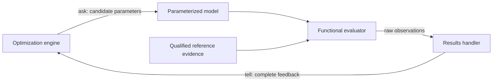
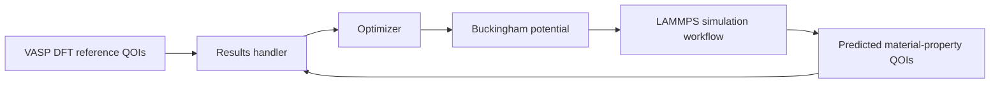
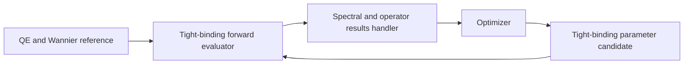

# Inverse-problem forward-evaluation architecture

An inverse problem seeks parameters `theta` whose forward-calculated
observations best explain independently established reference observations. For
a forward function `F`, predicted observations `y`, and reference observations
`y_ref`:

```text
y = F(theta)
feedback = L(y, y_ref)
```

## Common feedback boundary

Reference evidence is generated and qualified outside candidate optimization.
The optimizer proposes immutable candidates; a functional evaluator calculates
raw observations; a results handler preserves those observations, derives the
complete declared feedback, and sends it to the proposing optimizer.



The parameterized model, reference type, and forward evaluator are scientific
specializations. Sampling, Pareto selection, continuation, random state, and
checkpoints remain optimizer responsibilities. Raw observations, derived
losses, optimizer feedback, and scientific acceptance remain distinct.

## Historical interatomic-potential exemplar

The Ragasa MgO workflow creates reference material-property QOIs with VASP and
PBE-GGA before optimization. Candidate Buckingham potential parameters are then
evaluated through LAMMPS. The results handler compares predicted and reference
QOIs, and Pareto-efficient candidate parameters guide later KDE proposals.



This exemplar supplies historical evidence for multidimensional proposals,
constraint resolution, forward-evaluation failures, complete objective vectors,
Pareto selection, and iterative distribution refinement. It is not the target
scientific product.

## Reduced-Hamiltonian target adaptation

The first target consumer is the `ksdft2effmass` bulk-silicon
[spectral/operator compatibility problem](../../reduced-hamiltonian-inverse-problem/architecture/index.md).
Quantum ESPRESSO and Wannier90 generate a qualified ten-orbital reference
Hamiltonian outside the loop. Each candidate evaluation constructs an
orthogonal `sp3s*` tight-binding Hamiltonian in process and calculates spectral
and aligned-operator observations.



Unlike the historical exemplar, candidate evaluation launches no external
first-principles or molecular-dynamics calculator. The forward calculation is
deterministic Hamiltonian construction, diagonalization, alignment, and
residual evaluation against the frozen parent.

## Effect and workflow boundary

A functional evaluator may compose an external simulation workflow or an
in-process mathematical model. External simulations use accepted CPN and
workflow contracts and explicit integrations. In-process evaluation still uses
identified immutable requests, results, numerical-policy identities, and
classified failures, but it must not be forced through a calculator process
abstraction merely to resemble the historical implementation.
