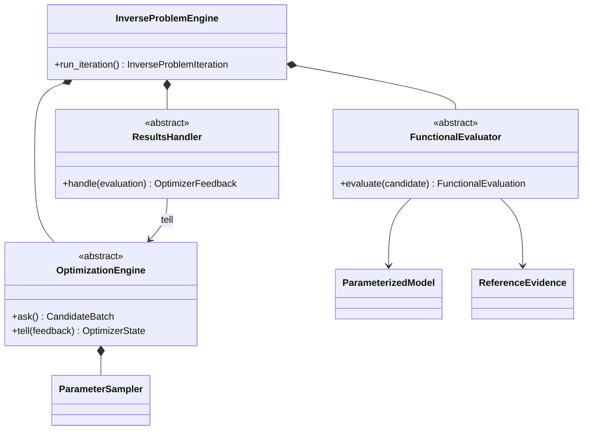

# Inverse-problem forward-evaluation implementation

`OptimizationEngine`, `FunctionalEvaluator`, and `ResultsHandler` are nominal
runtime roles, not structural protocols. The concrete results handler is wired
to the exact optimization-engine instance receiving feedback. Immutable request,
candidate, observation, feedback, and checkpoint objects remain separate from
mutable working state and external effects.

The historical potential-fitting realization composes an interatomic potential,
structure and QOI definitions, a simulation planner, workflow execution,
material-property evaluators, and calculator integrations. It remains useful as
reconstruction and conformance evidence.

The target reduced-Hamiltonian realization is defined in the
[`reduced-hamiltonian-inverse-problem`](../../reduced-hamiltonian-inverse-problem/implementation/index.md)
module. It composes a tight-binding model class, immutable parameter candidates,
a qualified Kohn--Sham/Wannier reference, an in-process spectral/operator
functional evaluator, and a results handler producing the ordered objective
vector.

Generic roles and historical behavior may incubate under
`projectkoios.frankensteins`. Application-specific tight-binding definitions,
reference records, QOIs, fitting policy, and scientific claims remain owned by
`ksdft2effmass`. Transfer must adapt to its accepted contracts rather than
creating a parallel application framework.
