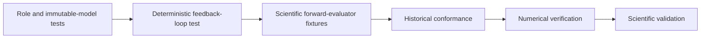

# Inverse-problem forward-evaluation testing

Fast tests verify candidate identity, independent parameter sampling,
`ask`/`evaluate`/`handle`/`tell` ordering, raw-observation preservation,
classified failures, deterministic replay, and feedback delivery to the
proposing optimizer instance.

Historical potential-fitting tests separately cover QOI-to-simulation planning,
shared-task deduplication, calculator adapters, Pareto selection, and KDE
continuation. They establish reconstruction conformance only.

Reduced-Hamiltonian tests use synthetic represented operators to cover model
construction, spectra, alignment, operator residuals, complete feedback vectors,
training/withheld separation, and model-hierarchy selection. They establish
software and bounded numerical behavior only. Production Quantum ESPRESSO and
Wannier90 reference qualification, bulk-silicon fitting, sensitivity analysis,
and scientific conclusions remain separate evidence owned by `ksdft2effmass`.
