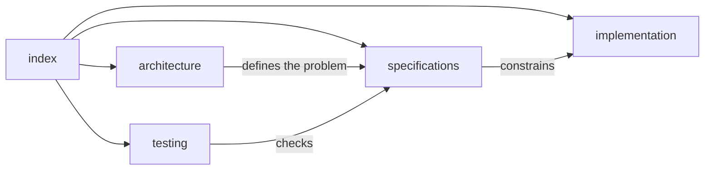

# Architectural module documentation standard

Every target architectural module uses this structure:

```text
module-name/
├── index.md
├── architecture/index.md
├── implementation/index.md
├── specifications/index.md
└── testing/index.md
```

## Page responsibilities

- `index.md` defines scope, status, ownership, and links to the four views.
- `architecture/index.md` explains the problem, forces, boundaries, information
  flow, and failure concepts without discussing package layout or concrete class
  design.
- `implementation/index.md` contains proposed packages, protocols, classes,
  dependency direction, and historical adapters. Mermaid class and package
  diagrams belong here.
- `specifications/index.md` states normative inputs, outputs, invariants,
  identities, errors, and serialization requirements. Use **MUST**, **SHOULD**,
  and **MAY** deliberately.
- `testing/index.md` defines unit, contract, conformance, integration, numerical,
  and scientific-validation obligations without conflating those claim levels.



Architecture pages must not become inventories of classes. Implementation pages
must not redefine scientific requirements. Testing pages must identify the
claim supported by each test family.
