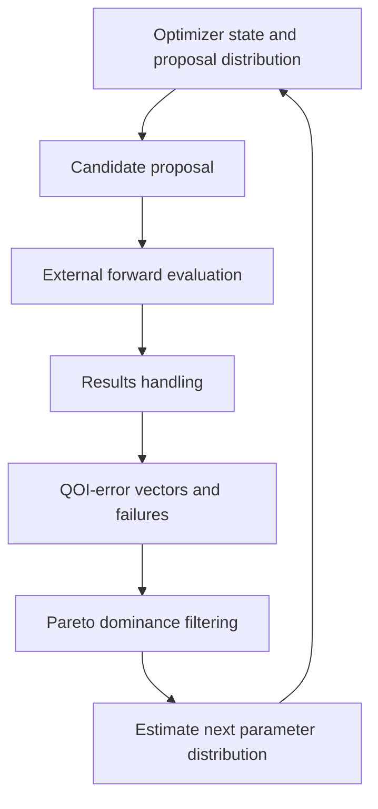

# Multi-objective optimization architecture

The problem is to search a constrained candidate space when success is described
by several competing QOI errors. Search remains independent of candidate forward
evaluation so the same scientific problem can support historical sampling, new
algorithms, and replay.

For the Ragasa MgO method, the initial proposal is an independent bounded
uniform prior over six free Buckingham parameters. Each viable candidate returns
one squared error per training QOI. Pareto filtering removes dominated
candidates without first collapsing the error vector into a weighted scalar.
A KDE estimated from Pareto-efficient parameter vectors supplies later
proposals. Statistical comparison of successive distributions provides a
convergence measure.

The optimizer boundary accepts stable candidate identities and completed error
vectors. It owns proposal, Pareto selection, distribution estimation, random
state, stopping, and restart state. It does not own reference-QOI generation,
forward simulations, structures, calculator processes, or material-property
formulas.

A failed forward evaluation remains an identified outcome; it must not disappear
from provenance even when excluded from the viable Pareto population.
Reproducibility requires optimizer state, random state, evaluated candidate
identities, accepted error vectors, and algorithm configuration to move
together. Preference-dependent down-selection of final potentials occurs after
Pareto-ensemble generation and is not implicit optimizer weighting.
