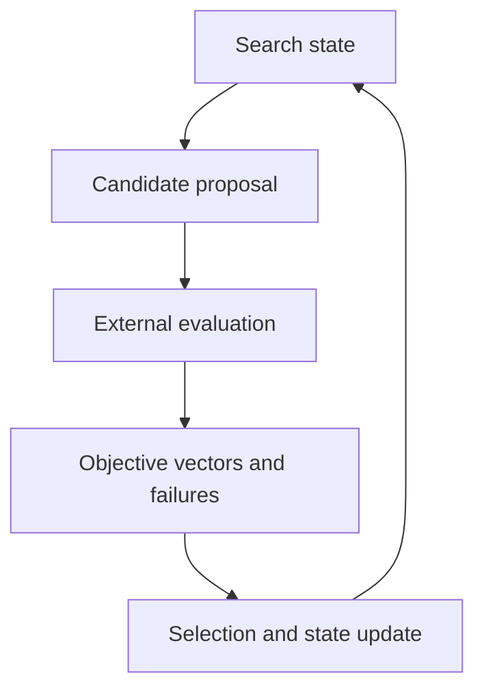

# Multi-objective optimization architecture

The problem is to search a constrained candidate space when success is described
by several competing losses. Search must remain independent of how candidates
are evaluated so the same scientific problem can support historical sampling,
new algorithms, and replay.

The boundary accepts stable candidate identities and completed evaluations. It
owns proposal, selection, random state, stopping, and restart state. It does not
own physical targets, simulation tasks, workspaces, or calculator processes.

A failed evaluation remains an identified outcome; it must not disappear from
the population silently. Reproducibility requires the search state, random
state, accepted evaluations, and algorithm configuration to move together.
