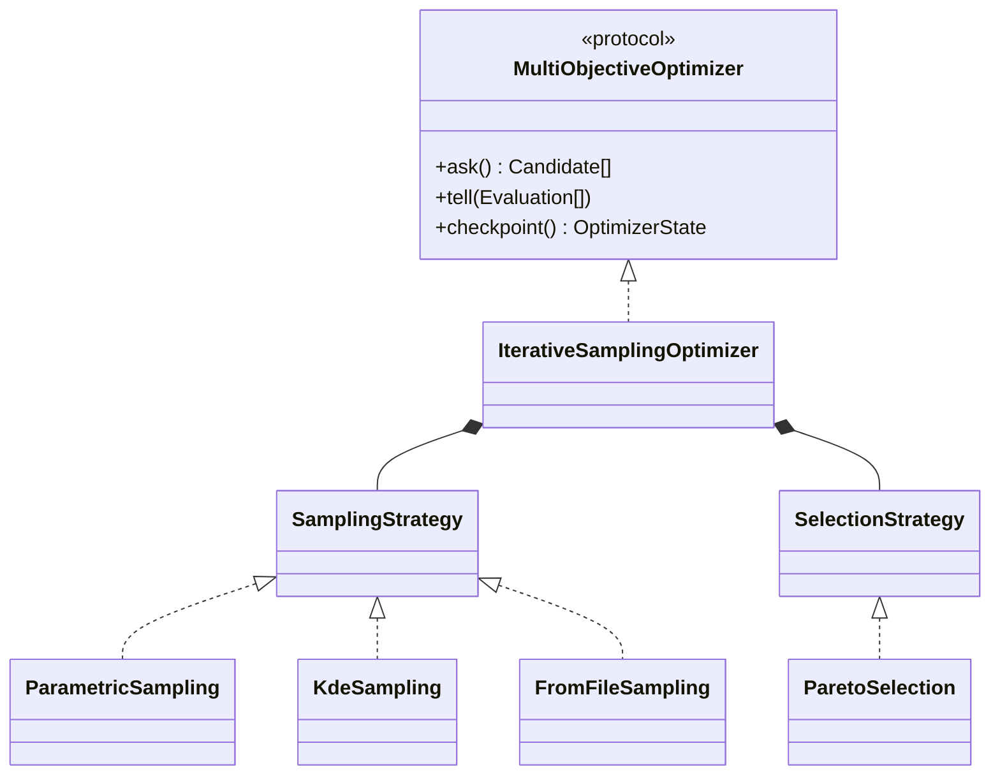
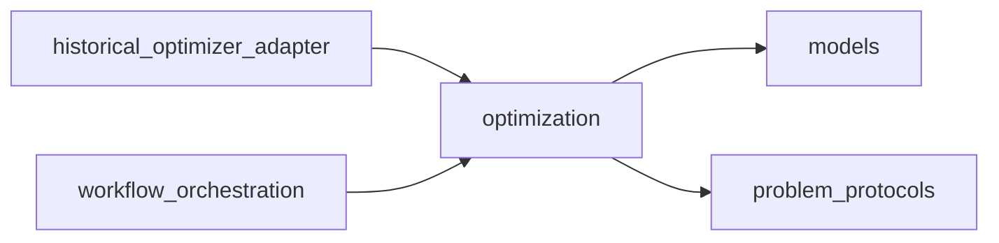

# Multi-objective optimization implementation

**Proposed package:** `projectkoios.frankensteins.optimization`

The protocol uses immutable candidates, evaluations, objective vectors, and
checkpoints. Historical PyPosPack state is translated by an adapter rather than
exposed through this package.
