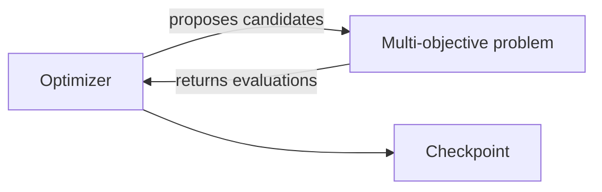

# Multi-objective optimization

**Status:** Target module

This module owns search policy over a problem that exposes candidate evaluation
and objective vectors. It is independent of potential models and calculators.

- [Architecture](architecture/index.md)
- [Implementation](implementation/index.md)
- [Specifications](specifications/index.md)
- [Testing](testing/index.md)
