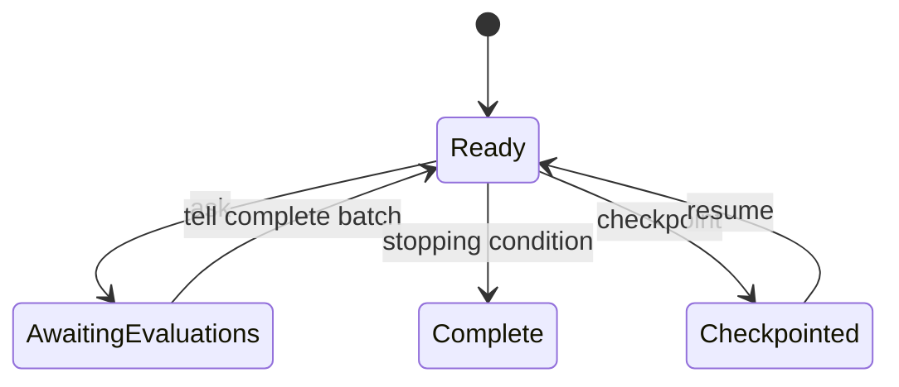

# Multi-objective optimization specifications

- Candidate identifiers **MUST** be unique within a run and stable across restart.
- `ask` **MUST NOT** mutate scientific problem data.
- `tell` **MUST** reject unknown, duplicate, or incompatible evaluations.
- Objective ordering and minimization direction **MUST** be explicit and stable.
- Random state, algorithm state, iteration index, and accepted evaluation
  identities **MUST** be checkpointed atomically.
- Failed evaluations **MUST** retain candidate identity and failure class.
- Optimizer configuration **MUST NOT** contain calculator paths or structure
  contents.
- Deterministic replay **SHOULD** be possible when given the same checkpoint and
  ordered evaluations.
