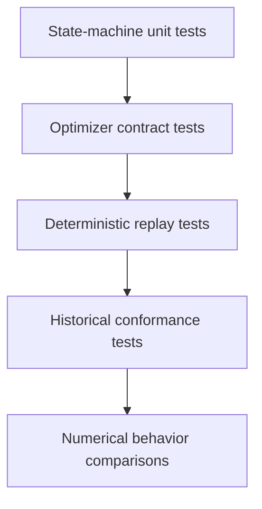

# Multi-objective optimization testing

- Unit tests cover proposal counts, state transitions, objective ordering,
  selection ties, failures, and stopping conditions.
- Property tests cover seed reproducibility, checkpoint round trips, duplicate
  rejection, and population invariants.
- Contract tests use a calculator-free synthetic problem.
- Historical conformance tests compare parametric, KDE, from-file, and Pareto
  behavior against the pinned implementation on bounded fixtures.
- Numerical comparisons report tolerances and environment; they do not establish
  scientific validation.
