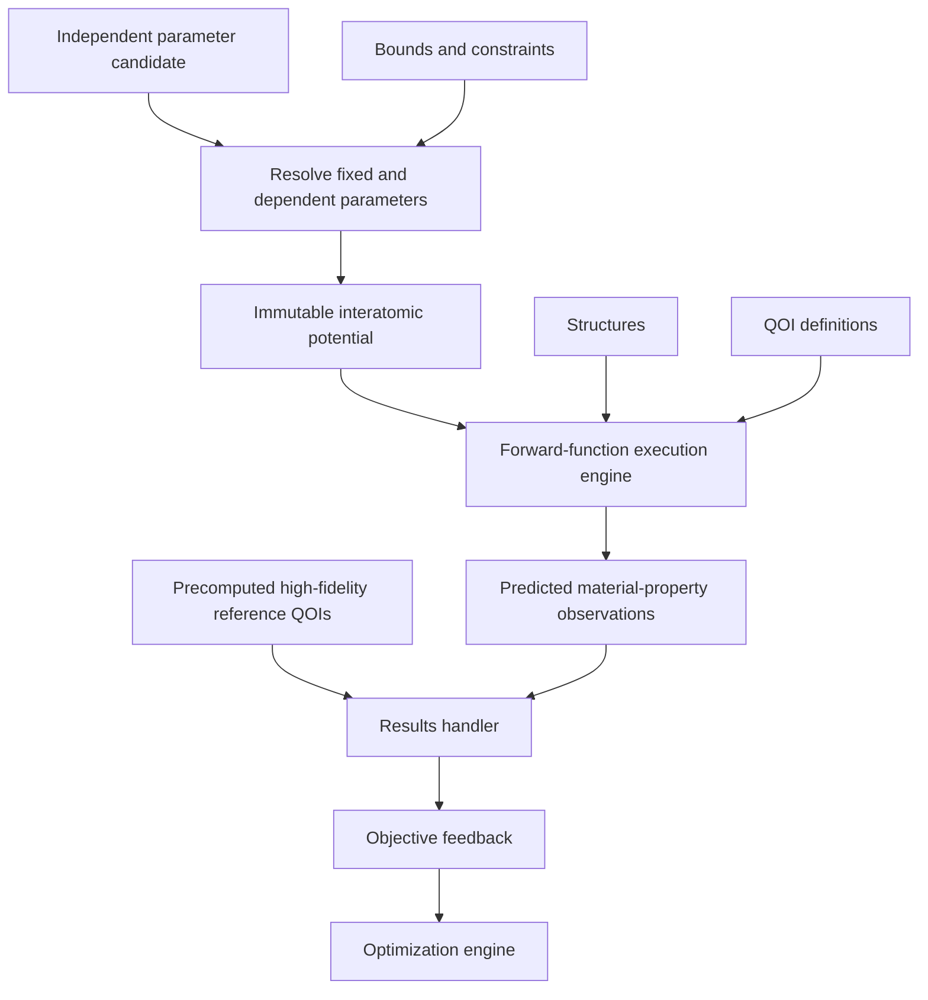

# Potential optimization architecture

Potential optimization asks which immutable interatomic-potential parameters
best reproduce several physical observations subject to model, charge, and
parameter constraints. It is an inverse problem solved through repeated forward
evaluation.

The scientific problem owns potential-family semantics, parameter resolution,
constraints, structures, requested material-property QOIs, identified reference
QOI observations, and the declared transformation from observations to
feedback. The optimization engine owns candidate proposal and update policy.
Reference QOIs are generated and qualified outside the loop through the same QOI
architecture using a higher-fidelity source.

The candidate forward-function execution engine takes one potential candidate,
structures, and QOI definitions. It plans and deduplicates required simulations,
executes them through workflow and LAMMPS integration boundaries, retains their
evidence, and calculates predicted QOI observations. It does not compare those
observations with high-fidelity references. A separate pre-loop configuration
uses VASP and a DFT model to produce those reference observations.

Raw observations are durable scientific results. Objective losses are derived
views and must not replace them. Invalid parameters, failed planning, failed
simulations, missing observations, undefined objective transformations, and
optimizer update failures are distinct categories.
