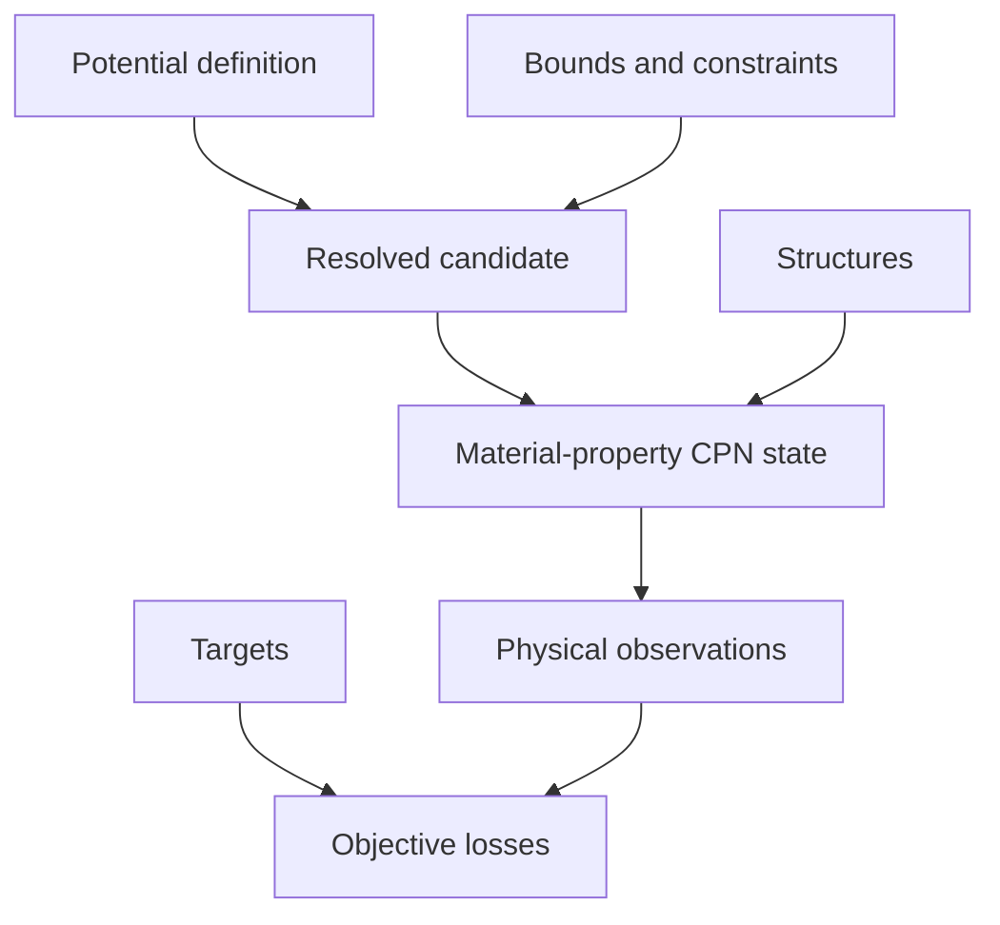

# Potential optimization architecture

Potential optimization asks which parameterization best reproduces several
physical observations subject to model, charge, and parameter constraints. The
central difficulty is preserving scientific meaning while evaluation spans many
structures and simulations.

The problem owns parameter resolution, structures, required observations,
targets, and the declared transformation from observations to losses. Its
material-property requirements are mapped into a colored Petri net ultimately
owned by `projectkoios-cpn`. Search policy and process execution remain outside the
boundary.

Raw observations are durable scientific results. Objective losses are derived
views and must not replace them. Invalid parameters, failed simulations, missing
observations, and undefined objective transformations are distinct failure
categories.
