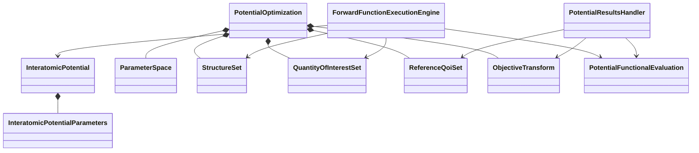
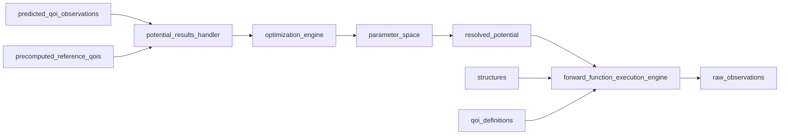

# Potential optimization implementation

**Incubation package:** `projectkoios.frankensteins.potential_optimization`

`InteratomicPotentialParameters` contains one complete immutable candidate after
independent, fixed, and dependent values have been resolved.
`PotentialFunctionalEvaluation` retains simulation-plan and workflow identities,
calculator evidence, raw material-property observations, and an optional
classified failure. `PotentialResultsHandler` derives objective feedback without
discarding that evaluation evidence.
