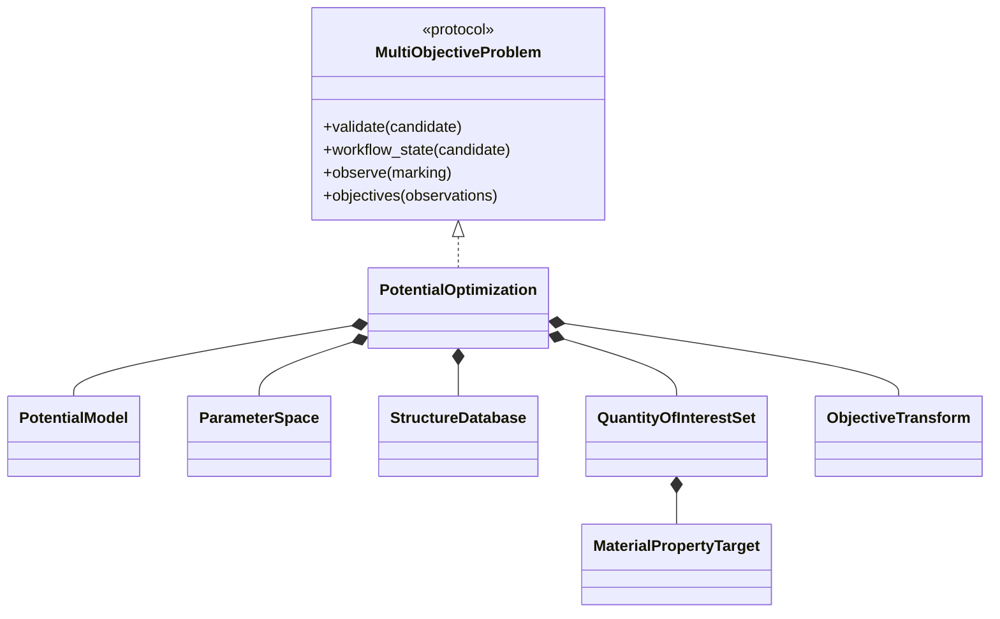
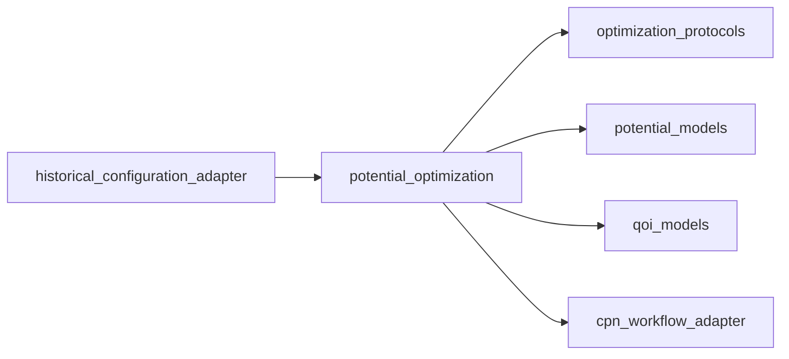

# Potential optimization implementation

**Proposed package:** `projectkoios.frankensteins.potential_optimization`

`PotentialCandidate` contains independent and fully resolved parameters.
`PotentialEvaluation` retains CPN definition and marking identities, simulation
result references, material-property observations, objective losses, and an
optional classified failure.
