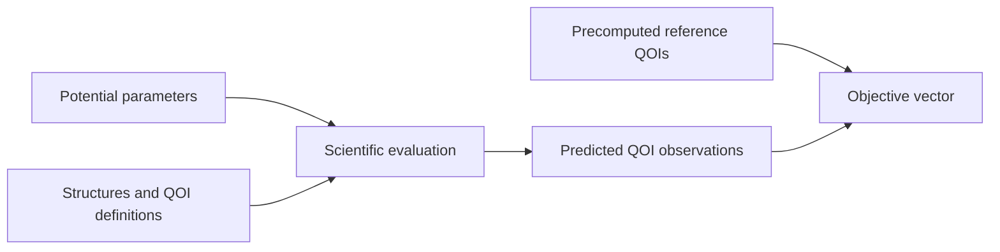

# Potential optimization

**Status:** Target module

This module specializes the
[inverse-problem forward-evaluation architecture](../inverse-problem-forward-evaluation/index.md)
for fitting an immutable interatomic potential against high-fidelity,
structure-derived reference quantities of interest. It owns scientific problem
meaning but not optimizer
search policy or calculator process authority.

- [Architecture](architecture/index.md)
- [Implementation](implementation/index.md)
- [Specifications](specifications/index.md)
- [Testing](testing/index.md)
