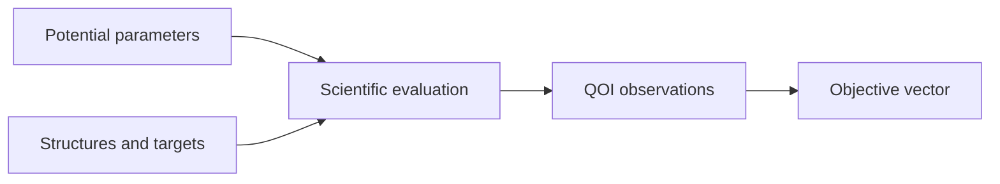

# Potential optimization

**Status:** Target module

This module defines the scientific problem of fitting a potential against
structure-derived quantities of interest. It does not own search or calculator
process policy.

- [Architecture](architecture/index.md)
- [Implementation](implementation/index.md)
- [Specifications](specifications/index.md)
- [Testing](testing/index.md)
