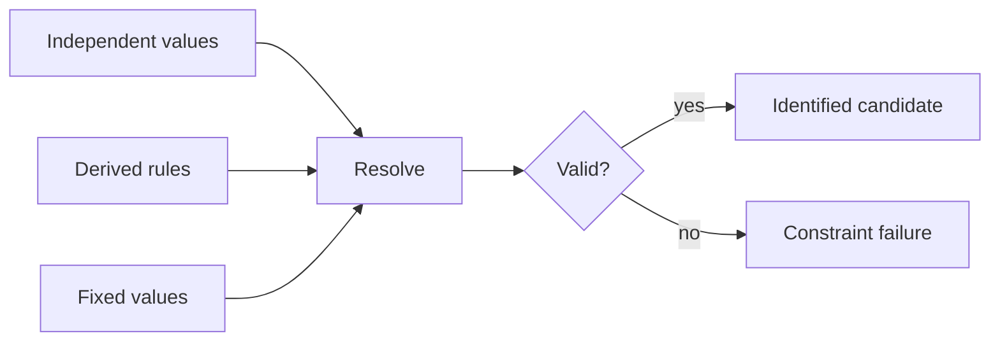

# Potential optimization specifications

- Potential family, symbols, parameter schema, structures, QOIs, targets, units,
  and loss transforms **MUST** be explicit immutable problem data.
- Derived expressions **MUST** use a bounded grammar and **MUST NOT** use Python
  `eval`.
- A candidate **MUST** include all resolved parameters required by its potential.
- Candidate identity **MUST** cover the resolved scientific inputs.
- Parameter failures, simulation failures, QOI failures, and objective failures
  **MUST** remain distinguishable.
- Raw QOI observations **MUST** be retained before objective transformation.
- CPN definition and initial-marking construction **MUST** be deterministic for
  the same problem and candidate.
- CPN semantics **MUST** use the accepted `projectkoios-cpn` contract rather
  than a local task graph; workflow orchestration **MUST** use the accepted
  `projectkoios-workflow` contract.
- The problem **MUST NOT** choose sampling modes, Pareto policy, MPI size, or
  executable paths.
