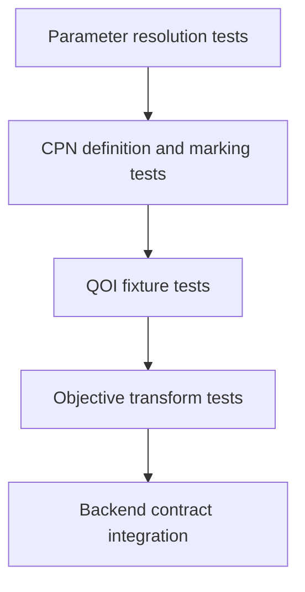

# Potential optimization testing

- Unit tests cover independent, fixed, and derived parameters; bounds; safe
  expression rejection; and deterministic candidate identities.
- Structure and QOI-reference tests reject missing or incompatible definitions,
  units, conventions, source identities, and structure roles.
- Reference-generation tests are outside the optimizer loop and retain VASP/DFT
  configuration, convergence, artifact, provenance, and qualification evidence.
- Golden CPN tests use identified structures and candidates to compare exact
  definitions, initial markings, enabled bindings, and successor markings
  without launching a calculator.
- Objective tests retain both predicted and reference observations and exercise
  signed, absolute, relative, normalized, and failure cases explicitly.
- Integration tests use a fake backend before any LAMMPS tests.
- Scientific-validation datasets and acceptance criteria require a separate,
  reviewed plan.
