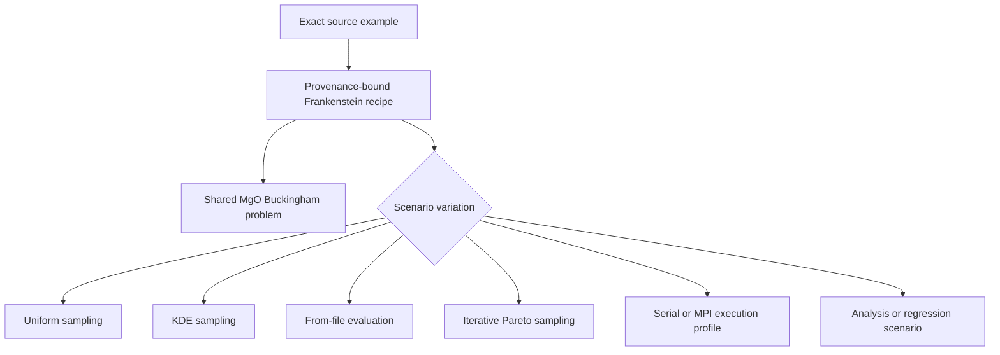

# PyFlamestk MgO examples architecture

The historical examples express one related MgO Buckingham problem through
several sampling, execution, analysis, and regression workflows. Treating each
script as an independent engine would duplicate scientific meaning and preserve
historical orchestration as architecture.

The existing Frankenstein reconstruction is the mandatory source boundary. It
captures source identities, observed settings, calculator intents, structures,
mathematical models, warnings, and execution-disabled status. A worked example
uses those reconstructed facts to configure maintained domain models; it does
not reread or execute the historical entrypoint.

Scientifically equivalent examples share one potential problem and reusable CPN
fragment templates. Sampling method is optimizer policy. Serial versus MPI is
execution policy. Postprocessing and regression are observation/replay concerns.
Content-identical source trees remain distinct provenance bindings but may share
the same maintained scenario template.
